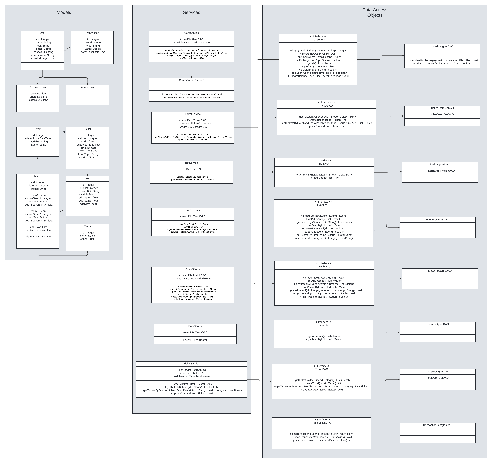

# Better Bet

## 1. Visão Geral
**Better Bet** é uma aplicação de casa de apostas desenvolvida em Java (JDK 21) usando Swing para a interface gráfica e PostgreSQL para o banco de dados. A aplicação permite aos usuários realizar apostas em eventos esportivos e gerenciar suas contas.

## 2. Pré-requisitos
- **Java JDK**: Versão 21 ou superior.
- **PostgreSQL**: Certifique-se de que o PostgreSQL esteja instalado e configurado.
- **Arquivo de Configuração**: A aplicação usa um arquivo `config.properties` para armazenar as informações de conexão com o banco de dados.

## 3. Instalação

### 3.1 Clonar o repositório
```bash
git clone https://github.com/DeivisonCs/BetterBet.git
```

### 3.2 Navegar até o diretório do projeto
```bash
cd BetterBet
```

### 3.3.1 Configurar o banco de dados localmente
1. Certifique-se de que o PostgreSQL esteja em execução.
2. Crie o banco de dados chamado `betterbetdb`:

```sql
CREATE DATABASE betterbetdb;
```
   
### 3.3.2 Configurar o banco de dados com docker compose
1. Certifique-se de ter o docker e o docker-compose instalados.
2. Navegue até a pasta do projeto, caso não esteja nela.
3. Execute o comando no seu terminal:

```bash
docker-compose up
```
As versões mais recentes do docker dispensam o uso do hífen no comando:

```bash
docker compose up
```
   
### 3.4 Configurar o arquivo `config.properties`
Antes de executar a aplicação, configure o arquivo `config.properties` localizado no diretório raiz do projeto. Ele deve conter as seguintes propriedades:

```properties
database.url=jdbc:postgresql://localhost:5434/betterbetdb
database.username=seu_usuario
database.password=sua_senha
```

Caso nçao utilize o compose certifique-se de substituir `seu_usuario` e `sua_senha` com as credenciais corretas do PostgreSQL, e a porta por 5432(ou a que estiver utilizando).

Caso utilize o compose supstitua `seu_usuario` e `sua_senha` por `postgres` e `postgres` respectivamente.

### 3.5 Compilar e executar
Se estiver utilizando uma IDE como IntelliJ ou Eclipse, importe o projeto como um projeto Java. Caso contrário, compile o código manualmente:

```bash
javac -d bin src/*.java
```

Execute a aplicação:

```bash
java -cp bin Main
```

## 4. Estrutura do Projeto

### Pacotes
- **Pacote `app`**: Contém as classes com as interfaces gráficas.
- **Pacote `components`**: Contém componentes de tela utilizados nas interfaces gráficas.
- **Pacote `dao`**: Contém as classes de acesso a dados.
- **Pacote `database`**: Contém as classes relacionadas ao banco de dados.
- **Pacote `exceptions`**: Contém classes para tratamento de exceções.
- **Pacote `middleware`**: Contém classes para a lógica intermediária entre a GUI e o banco de dados.
- **Pacote `models`**: Contém as classes que representam os modelos de dados.
- **Pacote `resources`**: Contém as imagens da aplicação.
- **Pacote `security`**: Contém a parte de segurança relacionada à encriptação de senhas.
- **Pacote `services`**: Contém serviços e lógica de negócio.

### Contas e Banco de Dados
- **Contas**: Ao executar o projeto pela primeira vez, uma conta comum e uma conta de admin são criadas automaticamente:
  - **Conta Admin**:
    - Email: `admin@gmail.com`
    - Senha: `adminpass`
  - **Conta Comum**:
    - Email: `van@gmail.com`
    - Senha: `van123`
- **Banco de Dados**: As tabelas necessárias são criadas automaticamente no banco de dados `betterbetdb`, mas é necessário garantir que o banco de dados já exista, seguindo os passos `3.3.1` ou `3.3.2`.

### Diagrama de Classes


### Modelagem Banco de Dados


## 5. Funcionalidades
- **Cadastro e Login de Usuários**: Os usuários podem se registrar e fazer login na plataforma.
- **Gerenciamento de Apostas**: Permite aos usuários fazer apostas em eventos esportivos com diferentes valores.
- **Cadastro de Partidas**: Permite aos usuários do tipo Admin criar novas partidas.
- **Cadastro de Eventos**: Permite aos usuários do tipo Admin criar novos eventos.
- **Histórico de Apostas**: Os usuários podem visualizar o histórico completo de suas apostas.

## 6. Interface Gráfica (GUI)
- **Tela de Login**: Tela que permite o login de um usuário cadastrado.
- **Tela de Cadastro**: Tela que permite o registro de novos usuários.
- **Tela de Apostas**: Interface para selecionar eventos e realizar apostas.
- **Tela de Perfil**: Exibe as informações do usuário e permite fazer transações.
- **Tela de Histórico**: Exibe as apostas anteriores do usuário.
- **Tela de Cadastro de Partida**: Interface para cadastro de novas partidas.
- **Tela de Eventos**: Interface para cadastro de novos eventos(campeonatos, ligas, etc).
- **Tela de Cadastro de Admin**: Interface para cadastro de novos administradores.

## 7. Como Usar
1. Abra a aplicação e faça login ou crie uma nova conta.
2. Na tela de apostas, escolha o evento desejado e insira o valor a ser apostado.
3. Visualize o histórico de apostas a qualquer momento na tela dedicada.

